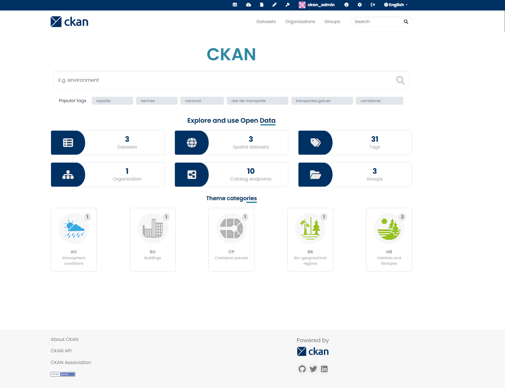

<h1 align="center">ckanext-schemingdcat. LOD/INSPIRE metadata enhancement for ckanext-scheming</h1>
<p align="center">

<p align="center">
    <a href="#overview">Overview</a> •
    <a href="#installation">Installation</a> •
    <a href="#configuration">Configuration</a> •
    <a href="#schemas">Schemas</a> •
    <a href="#harvesters">Harvesters</a> •
    <a href="#dcat-profiles">DCAT Profiles</a> •
    <a href="#running-the-tests">Running the Tests</a> •
    <a href="#development">Development</a>
</p>

## Overview
This CKAN extension provides functions and templates specifically designed to extend `ckanext-scheming` and `ckanext-dcat` and includes RDF profiles and Harvest enhancements to adapt CKAN Schema to multiple metadata profiles as: [GeoDCAT-AP](./ckanext/schemingdcat/schemas/geodcat_ap/es_geodcat_ap_full.yaml) or [DCAT-AP](./ckanext/schemingdcat/schemas/dcat_ap/eu_dcat_ap_full.yaml).

> [!WARNING] 
> This project requires [mjanez/ckanext-dcat](https://github.com/mjanez/ckanext-dcat) (for newer releases) or [ckan/ckanext-dcat](https://github.com/ckan/ckanext-dcat) (older), along with [ckan/ckanext-scheming](https://github.com/ckan/ckanext-scheming) and [ckan/ckanext-spatial](https://github.com/ckan/ckanext-spatial) to work properly. 
> * If you want to use custom schemas with multilingual support, you need to use `ckanext-fluent`. A fixed version is available at [mjanez/ckanext-fluent](https://github.com/mjanez/ckanext-fluent).
> * If you want to use custom harvesters, you need to use `ckanext-harvest`, an improved, more private version is avalaibe at [mjanez/ckanext-harvest](https://github.com/mjanez/ckanext-harvest).

> [!TIP]
> It is **recommended to use with:** [`ckan-docker`](https://github.com/mjanez/ckan-docker) deployment or only use [`ckan-pycsw`](https://github.com/mjanez/ckan-pycsw) to deploy a CSW Catalog.



Enhancements:
- Custom schemas for `ckanext-scheming` in the plugin like [CKAN GeoDCAT-AP custom schemas](ckanext/schemingdcat/schemas#readme)
- [`ckanext-dcat` profiles](#dcat-profiles) for RDF serialization according to profiles such as DCAT, DCAT-AP, GeoDCAT-AP and in the Spanish context, NTI-RISP.
- Improve metadata management forms to include tabs that make it easier to search metadata categories and simplify metadata editing.
- Improve the search functionality in CKAN for custom schemas. It uses the fields defined in a scheming file to provide a set of tools to use these fields for scheming, and a way to include icons in their labels when displaying them. More info: [`ckanext-schemingdcat`](https://github.com/mjanez/ckanext-schemingdcat)
- Add improved harvesters for custom metadata schemas integrated with `ckanext-harvest` in CKAN using [`mjanez/ckan-ogc`](https://github.com/mjanez/ckan-ogc).
- Add an [expanded Harvester for CSW](#csw-inspire-iso-19139-endpoint) servers using XLST mapping ([ISO19139 to DCAT-AP](https://raw.githubusercontent.com/mjanez/iso-19139-to-dcat-ap/refs/heads/main/iso-19139-to-dcat-ap.xsl)) to transform the metadata to RDF ([DCAT-AP](https://semiceu.github.io/DCAT-AP/releases/3.0.0)/[GeoDCAT-AP](https://semiceu.github.io/GeoDCAT-AP/releases/3.0.0/) 3) and import it into CKAN.
- Add Metadata downloads for Linked Open Data formats ([`mjanez/ckanext-dcat`](https://github.com/mjanez/ckanext-dcat)) and Geospatial Metadata (ISO 19139, Dublin Core, etc. with [`mjanez/ckan-pycsw`](https://github.com/mjanez/ckanext-pycsw))
- Add custom i18n translations to `datasets`, `groups`, `organizations` in schemas, e.g: [GeoDCAT-AP (ES)](#geodcat-ap-es).[^1]
- Add a set of useful helpers and templates to be used with Metadata Schemas.
- [Update the base theme](#new-theme) of CKAN to use with the enhancements of this extension, now using Tabs instead of older `stages`.
- Modern UI inspired on [`datopian/ckanext-datopian`](https://github.com/datopian/ckanext-datopian).
- LOD/OGC Endpoints based on avalaible profiles (DCAT) and CSW capabilities with [`mjanez/ckan-pycsw`](https://github.com/mjanez/ckanext-pycsw).
- Publisher (organization `admin`) and `editor` logic to control the visibility of records in a regular metadata monitoring workflow.
- [CSW Harvester](#csw-inspire-202-endpoint) to remote CSW catalogues using the INSPIRE ISO 19139 metadata profile.

## Requirements
### Compatibility
Compatibility with core CKAN versions:

| CKAN version | Compatible?                                                                 |
|--------------|-----------------------------------------------------------------------------|
| 2.8          | ❌ No (>= Python 3)                                                          |
| 2.9          | ✅ Yes (<= [`v3.2.3`](https://github.com/mjanez/ckanext-schemingdcat/releases/tag/v3.2.3)) |
| 2.10         | ✅ Yes (>= [`v4.0.0`](https://github.com/mjanez/ckanext-schemingdcat/releases/tag/v4.0.0)) |

### Plugins
This plugin needs the following plugins to work properly:

  ```sh
  # Install latest stable release of:
  ## ckan/ckanext-scheming: https://github.com/ckan/ckanext-scheming/tags (e.g. release-3.0.0)
  pip install -e git+https://github.com/ckan/ckanext-scheming.git@release-3.0.0#egg=ckanext-scheming

  ## mjanez/ckanext-dcat: https://github.com/mjanez/ckanext-dcat/tags (e.g. 1.8.0)
  pip install -e git+https://github.com/mjanez/ckanext-dcat.git@1.8.0#egg=ckanext-dcat
  pip install -r https://raw.githubusercontent.com/mjanez/ckanext-dcat/master/requirements.txt

  ## ckan/ckanext-spatial: https://github.com/ckan/ckanext-spatial/tags (e.g. v2.1.1)
  pip install -e git++https://github.com/ckan/ckanext-spatial.git@v2.1.1/#egg=ckanext-spatial#egg=ckanext-spatial
  pip install -r https://raw.githubusercontent.com/ckan/ckanext-spatial/v2.1.1/requirements.txt

  ## ckan/ckanext-harvest: https://github.com/ckan/ckanext-harvest/tags (e.g. v1.5.6)
  pip install -e git++https://github.com/ckan/ckanext-harvest.git@v1.5.6#egg=ckanext-spatial
  pip install -r https://raw.githubusercontent.com/ckan/ckanext-harvest/v1.5.6/requirements.txt

  ## ckan/ckanext-fluent: https://github.com/mjanez/ckanext-fluen/tags (e.g. v1.0.1)
  pip install -e git++https://github.com/mjanez/ckanext-fluent.git@v1.0.1#egg=ckanext-fluent
  ```

## Installation
  ```sh
  cd $CKAN_VENV/src/

  # Install the scheming_dataset plugin
  pip install -e "git+https://github.com/ckan/ckanext-schemingdcat.git#egg=ckanext-schemingdcat"
  ```

## Configuration
Set the plugin:

  ```ini
  # Add the plugin to the list of plugins
  ckan.plugins = ... spatial_metadata ... dcat ... schemingdcat
  ```
> [!WARNING] 
> When using `schemingdcat` extension,**`scheming` should not appear in the list of plugins loaded in CKAN.** But `dcat` and `spatial` should.

### Scheming DCAT
Set the schemas you want to use with configuration options:

  ```ini
  # Each of the plugins is optional depending on your use
  ckan.plugins = schemingdcat_datasets schemingdcat_groups schemingdcat_organizations
  ```

To use CSW Endpoint in `ckanext-schemingdcat`:

  ```ini
  schemingdcat.geometadata_base_uri = http://localhost:81/csw
  ckanext.dcat.base_uri = http://localhost:81/catalog
  ```

To use custom schemas in `ckanext-scheming`:

  ```ini
  # module-path:file to schemas being used
  scheming.dataset_schemas = ckanext.schemingdcat:schemas/geodcat_ap/es_geodcat_ap_full.yaml
  scheming.group_schemas = ckanext.schemingdcat:schemas/geodcat_ap/es_geodcat_ap_group.json
  scheming.organization_schemas = ckanext.schemingdcat:schemas/geodcat_ap/es_geodcat_ap_org.json

  #   URLs may also be used, e.g:
  #
  # scheming.dataset_schemas = http://example.com/spatialx_schema.yaml

  #   Preset files may be included as well. The default preset setting is:
  scheming.presets = ckanext.schemingdcat:schemas/default_presets.json

  #   The is_fallback setting may be changed as well. Defaults to false:
  scheming.dataset_fallback = false
  ```

### Harvest
**Requirement**:
- If you want to use custom harvesters, you need to use `ckanext-harvest`, an improved, more private version is avalaibe at [mjanez/ckanext-harvest](https://github.com/mjanez/ckanext-harvest).

Next add the [custom Harvesters](#harvesters) to the list of plugins as you need:

  ```ini
  ckan.plugins = ... spatial_metadata ... dcat ... schemingdcat ... harvest ... schemingdcat_ckan_harvester schemingdcat_csw_harvester ...
  ```

### Endpoints
You can update the [`endpoints.yaml`](./ckanext/schemingdcat/codelists/endpoints.yaml) file to add your custom OGC/LOD endpoints, only has 2 types of endpoints: `lod` and `ogc`, and the `profile` avalaible in [`ckanext-dcat`](https://github.com/mjanez/ckanext-dcat) Preferably between 4 and 8.

Examples:

* LOD endpoint: A Linked Open Data endpoint is a DCAT endpoint that provides access to RDF data. More information about the catalogue endpoint, how to use the endpoint, (e.g. `https://{ckan-instance-host}/catalog.{format}?[page={page}]&[modified_since={date}]&[profiles={profile1},{profile2}]&[q={query}]&[fq={filter query}]`, and more at [`ckanext-dcat`](https://github.com/mjanez/ckanext-dcat?tab=readme-ov-file#catalog-endpoint)
    ```yaml
      - name: eu_dcat_ap_2_rdf
        display_name: RDF DCAT-AP
        type: lod
        format: rdf
        image_display_url: /images/icons/endpoints/eu_dcat_ap_2.svg
        description: RDF DCAT-AP Endpoint for european data portals.
        profile: eu_dcat_ap_2
        profile_label: DCAT-AP
        version: null
    ```

* OGC Endpoint: An OGC CSW endpoint provides a standards-based interface to discover, browse, and query metadata about spatial datasets and data services. More info about the endpoint at [OGC: Catalogue Service](https://www.ogc.org/)standard/cat/
    ```yaml
      - name: csw_inspire
        display_name: CSW INSPIRE 2.0.2
        type: ogc
        format: xml
        image_display_url: /images/icons/endpoints/csw_inspire.svg
        description: OGC-INSPIRE Endpoint for spatial metadata.
        profile: es_dcat
        profile_label: INSPIRE
        version: 2.0.2
    ```

### Facet Scheming
To configure facets, there are no mandatory sets in the config file for this extension. The following sets can be used:

  ```ini
  schemingdcat.facet_list: [list of fields]      # List of fields in scheming file to use to faceting. Use ckan defaults if not provided.
  schemingdcat.default_facet_operator: [AND|OR]  # OR if not defined

   schemingdcat.icons_dir: (dir)                  # images/icons if not defined
  ```

As an example for facet list, we could suggest:

  ```ini
  schemingdcat.facet_list = "theme groups theme_es dcat_type owner_org res_format publisher_name publisher_type frequency tags tag_uri conforms_to spatial_uri"
  ```

The same custom fields for faceting can be used when browsing organizations and groups data:

  ```ini
  schemingdcat.organization_custom_facets = true
  schemingdcat.group_custom_facets = true
  ```

This two last settings are not mandatory. You can omit one or both (or set them to `false`), and the default fields for faceting will be used instead.

#### Facet Scheming integration with Solr
1. Clear the index in solr:

	`ckan -c [route to your .ini ckan config file] search-index clear`
   
2. Modify the schema file on Solr (schema or managed schema) to add the multivalued fields added in the scheming extension used for faceting. You can add any field defined in the schema file used in the ckanext-scheming extension that you want to use for faceting.
   You must define each field with these parameters:
   - `type: string` - to avoid split the text in tokens, each individually "faceted".
   - `uninvertible: false` - as recomended by solr´s documentation 
   - `docValues: true` - to ease recovering faceted resources
   - `indexed: true` - to let ckan recover resources under this facet 
   - `stored: true` - to let the value to be recovered by queries
   - `multiValued`: well... it depends on if it is a multivalued field (several values for one resource) or a regular field (just one value). Use "true" or "false" respectively. 
   
   E.g. [`ckanext-iepnb`](https://github.com/OpenDataGIS/ckanext-iepnb) extension are ready to use these multivalued fields. You have to add this configuration fragment to solr schema in order to use them:
	
    ```xml
    <!-- Extra fields -->
      <field name="tag_uri" type="string" uninvertible="false" docValues="true" indexed="true" stored="true" multiValued="true"/>
      <field name="conforms_to" type="string" uninvertible="false" docValues="true" indexed="true" stored="true" multiValued="true"/>
      <field name="lineage_source" type="string" uninvertible="false" docValues="true" indexed="true" stored="true" multiValued="true"/>
      <field name="lineage_process_steps" type="string" uninvertible="false" docValues="true" indexed="true" stored="true" multiValued="true"/>
      <field name="reference" type="string" uninvertible="false" docValues="true" indexed="true" stored="true" multiValued="true"/>
      <field name="theme" type="string" uninvertible="false" docValues="true" indexed="true" stored="true" multiValued="true"/>
      <field name="theme_es" type="string" uninvertible="false" docValues="true" multiValued="true" indexed="true" stored="true"/>
      <field name="metadata_profile" type="string" uninvertible="false" docValues="true" multiValued="true" indexed="true" stored="true"/>
      <field name="resource_relation" type="string" uninvertible="false" docValues="true" indexed="true" stored="true" multiValued="true"/>
    ```

    > [!NOTE] 
    >You can ommit any field you're not going to use for faceting, but the best policy could be to add all values at the beginning. 
    >
    >The extra fields depend on your [schema](/ckanext/schemingdcat/schemas/)
   	
	**Be sure to restart Solr after modify the schema.**
	
3. Restart CKAN. 
     
4. Reindex solr index:

	`ckan -c [route to your .ini ckan config file] search-index rebuild-fast`

	Sometimes solr can issue an error while reindexing. In that case I'd try to restart solr, delete index ("search-index clear"), restart solr, rebuild index, and restart solr again.
	
	Ckan needs to "fix" multivalued fields to be able to recover values correctly for faceting, so this step must be done in order to use faceting with multivalued fields. 

### Icons
Icons for each field option in the [`scheming file`](ckanext/schemingdcat/schemas/geodcat_ap/es_geodcat_ap_full.yaml) can be set in multiple ways:

- Set a root directory path for icons for each field using the `icons_dir` key in the scheming file.
- If `icons_dir` is not defined, the directory path is guessed starting from the value provided for the `schemingdcat.icons_dir` parameter in the CKAN config file, adding the name of the field as an additional step to the path (`public/images/icons/{field_name`).
- For each option, use the `icon` setting to provide the last steps of the icon path from the field's root path defined before. This value may be just a file name or include a path to add to the icon's root directory.
- If `icon` is not used, a directory and file name are guessed from the option's value.
- Icons files are tested for existence when using `schemingdcat_schema_icon` function to get them. If the file doesn't exist, the function returns `None`. Icons can be provided by any CKAN extension in its `public` directory.
- Set a `default icon` for a field using the default_icon setting in the scheming file. You can get it using `schemingdcat_schema_get_default_icon` function, and it is your duty to decide when and where to get and use it in a template.

## New theme
Update the base theme of CKAN to use with the enhancements of this extension.


**Improved home statistics**:


**Catalog endpoints** `/endpoints`:


**Search**:


**Dataset - Metadata info** `/dataset/{sample-dataset}`:


**Dataset - Form tabs**:


**Organizations** `/organization/{sample-org}`:


**Groups** `/group/{sample-group}`:


## Schemas
With this plugin, you can customize the group, organization, and dataset entities in CKAN. Adding and enabling a schema will modify the forms used to update and create each entity, indicated by the respective `type` property at the root level. Such as `group_type`, `organization_type`, and `dataset_type`. Non-default types are supported properly as is indicated throughout the examples.

Are available to use with this extension a number of custom schema, more info: [`schemas/README.md`](./ckanext/schemingdcat/schemas/README.md)

**Schema Enhancements:**
We've made several improvements to our schema to provide a better metadata and metadata group management. Here are some of the key changes:

- **Form Groups:** We've introduced the use of `form_groups` and improve `form_pages` in our schemas. This allows us to group related fields into the same form, making it easier to navigate and manage metadata.
- **Metadata Management Improvements:** We've improved how we manage metadata in our schema. It's now easier to add, remove, and modify metadata, allowing us to keep our data more organized and accessible.
- **Metadata Group Updates:** We've made changes to how we handle metadata groups (`form_groups`). It's now easier to group related metadata, helping us keep our data more organized and making it easier to find specific information.

For more details on these enhancements check [Form Groups documentation](#form-groups), please refer to the schema files in [`ckanext/schemingdcat/schemas`](ckanext/schemingdcat/schemas).

### GeoDCAT-AP (ES)
[`schemas/geodcat_ap/es_geodcat_ap_full`](/ckanext/schemingdcat/schemas/geodcat_ap/es_geodcat_ap_full.yaml) with specific extensions for spatial data and [GeoDCAT-AP](https://github.com/SEMICeu/GeoDCAT-AP)/[INSPIRE](https://github.com/INSPIRE-MIF/technical-guidelines) metadata [profiles](https://en.wikipedia.org/wiki/Geospatial_metadata). 

> [!NOTE] 
> RDF to CKAN dataset mapping: [GeoDCAT-AP (ES) to CKAN](ckanext/schemingdcat/schemas/README.md#geodcat-ap-es)


### DCAT 
[`schemas/dcat`](/ckanext/schemingdcat/schemas/dcat/dcat_dataset.yaml) based
on: [DCAT](https://www.w3.org/TR/vocab-dcat-3/).

> [!NOTE] 
> RDF to CKAN dataset mapping: [DCAT to CKAN](ckanext/schemingdcat/schemas/README.md#dcat)

### DCAT-AP (EU)
[`schemas/dcat_ap/eu_dcat_ap`](/ckanext/schemingdcat/schemas/dcat_ap/eu_dcat_ap.yaml) based on: [DCAT-AP](https://op.europa.eu/en/web/eu-vocabularies/dcat-ap) for the european context.

> [!NOTE] 
> RDF to CKAN dataset mapping: [DCAT-AP (EU) to CKAN](ckanext/schemingdcat/schemas/README.md#dcat-ap-eu)

### GeoDCAT-AP (EU)
[`schemas/geodcat_ap/eu_geodcat_ap`](/ckanext/schemingdcat/schemas/geodcat_ap/eu_geodcat_ap.yaml) based on: [GeoDCAT-AP](https://github.com/SEMICeu/GeoDCAT-AP) for the european context.

> [!NOTE] 
> RDF to CKAN dataset mapping: [GeoDCAT-AP (EU) to CKAN](ckanext/schemingdcat/schemas/README.md#geodcat-ap-eu)


### Form Groups
Form groups are a way to group related fields together in the same form. This makes it easier to navigate and manage metadata. A form group is defined with the following elements:

- `form_group_id`: A unique identifier for the form group. For example, `contact`.
- `label`: A human-readable label for the form group. This can be provided in multiple languages. For example:
    ```yaml
    label: 
      en: Contact information 
      es: Información de contacto
    ```
- `fa_icon`: An optional [Font Awesome icon](https://fontawesome.com/v4/icons/) that can be used to visually represent the form group. For example, `fa-address-book`.

Here is an example of a form group definition:

  ```yaml
  form_group_id: contact 
  label: 
    en: Contact information 
    es: Información de contacto 
  fa_icon: fa-address-book
  ```

#### Adding Fields to Form Groups
Fields can be added to a form group by specifying the `form_group_id` in the field definition. The `form_group_id` should match the `form_group_id` of the form group that the field should be part of.

Here is an example of a field that is part of the `general_info` form group:

  ```yaml
  field_name: owner_org
  label:
    en: Organization
    es: Organización
  required: True
  help_text:
    en: Entity (organisation) responsible for making the Dataset available.
    es: Entidad (organización) responsable de publicar el conjunto de datos.
  preset: dataset_organization
  form_group_id: general_info
  ```

In this example, the `owner_org` field will be part of the `general_info` form group.

## Harvesters
### Basic using
In production, when `gather` and `consumer` processes are running, the following command are used to start and stop the background processes:

  - `ckan harvester run`: Starts any harvest jobs that have been created by putting them onto
    the gather queue. Also checks running jobs - if finished it
    changes their status to Finished.

To testing harvesters in development, you can use the following command:
  - `ckan harvester run-test {source-id/name}`: This does all the stages of the harvest (creates job, gather, fetch, import) without involving the web UI or the queue backends. This is useful for testing a harvester without having to fire up gather/fetch_consumer processes, as is done in production.

    > [!WARNING]
    > After running the `run-test` command, you should stop all background processes for `gather` and `consumer` to avoid conflicts.


### Scheming DCAT CKAN Harvester: CKAN Harvester for custom schemas
The plugin includes a harvester for remote CKAN instances using the custom schemas provided by `schemingdcat` and `ckanext-scheming`. This harvester is a subclass of the CKAN Harvester provided by `ckanext-harvest` and is designed to work with the `schemingdcat` plugin to provide a more versatile and customizable harvester for CKAN instances.

To use it, you need to add the `schemingdcat_ckan_harvester` plugin to your options file:

  ```ini
	ckan.plugins = harvest schemingdcat schemingdcat_datasets ... schemingdcat_ckan_harvester
  ```

The Scheming DCAT CKAN Harvester supports the same configuration options as the [CKAN Harvester](https://github.com/ckan/ckanext-harvest#the-ckan-harvester), plus the following additional options:

* `dataset_field_mapping/distribution_field_mapping` (Optional):  Mapping field names from local to remote instance, all info at: [CKAN Harvester Field mapping structure](#field-mapping-structure)
* `field_mapping_schema_version` (**Mandatory if exists** `dataset_field_mapping/distribution_field_mapping`): Schema version of the field_mapping to ensure compatibility with older schemas. The default is `2`.
* `schema` (Optional): The name of the schema to use for the harvested datasets. This is the `schema_name` as defined in the scheming file. The remote and local instances must have the same dataset schema. If not provided, the `dataset_field_mapping/distribution_field_mapping` is needed to mapping fields.
* `allow_harvest_datasets` (Optional): If `true`, the harvester will create new records even if the package type is from the harvest source. If `false`, the harvester will only create records that originate from the instance. Default is `false`.
* `remote_orgs` (Optional): [WIP]. Only `only_local`.
* `remote_groups` (Optional): [WIP]. Only `only_local`.
* `clean_tags`: By default, tags are stripped of accent characters, spaces and capital letters for display. Setting this option to `False` will keep the original tag names. Default is `True`.

And example configuration might look like this:

  ```json
      {
      "api_version": 2,
      "clean_tags": false,
      "default_tags": [{"name": "inspire"}, {"name": "geodcatap"}],
      "default_groups": ["transportation", "hb"],
      "default_extras": {"encoding":"utf8", "harvest_description":"Harvesting from Sample Catalog", "harvest_url": "{harvest_source_url}/dataset/{dataset_id}"},
      "organizations_filter_include": ["remote-organization"],
      "groups_filter_include":[],
      "override_extras":false,
      "user":"harverster-user",
      "api_key":"<REMOTE_API_KEY>",
      "read_only": true,
      "remote_groups": "only_local",
      "remote_orgs": "only_local",
      "schema": "geodcatap",
      "allow_harvest_datasets":false,
      "field_mapping_schema_version":2,
      "dataset_field_mapping": {
        "title": {
            "field_name": "my_title"
          },
        "title_translated": {
            "languages": {
                "en": {
                    "field_name": "my_title-en"
                },
                "es": {
                    "field_name": "my_title"
                }
            }
        },
        "private": {
            "field_name": "private"
        },
        "tag_string": {
            "field_name": ["theme_a", "theme_b", "theme_c"]
        },
        "theme_es": {
            "field_value": "http://datos.gob.es/kos/sector-publico/sector/medio-ambiente"
        },
        "tag_uri": {
            "field_name": "keyword_uri",
            // "field_value" extends the original list of values retrieved from the remote file for all records.
            "field_value": ["https://www.example.org/codelist/a","https://www.example.org/codelist/b", "https://www.example.org/codelist/c"] 
        },
        "my_custom_field": {
            // If you need to map a field in a remote dict to the "extras" dict, use the "extras_" prefix to indicate that the field is there.
            "field_name": "extras_remote_custom_field"
        },
      },
      }
  ```
#### Field mapping structure
The `dataset_field_mapping`/`distribution_field_mapping` is structured as follows (multilingual version):

```json
{
  ...
  "field_mapping_schema_version": 2,
  "<dataset_field_mapping>/<distribution_field_mapping>": {
    "<schema_field_name>": {
      "languages": {
        "<language>":  {
          <"field_value": "<fixed_value>/<fixed_value_list>">,/<"field_name": "<excel_field_name>/<excel_field_name_list>">
        },
        ...
      },
      ...
    },
    ...
  }
}
```

* `<schema_field_name>`: The name of the field in the CKAN schema.
  * `<language>`: (Optional) The language code for multilingual fields. This should be a valid [ISO 639-1 language code](https://localizely.com/iso-639-1-list/). This is now nested under the `languages` key.
* `<fixed_value>/<fixed_value_list>`: (Optional) A fixed value or a list of fixed values that will be assigned to the field for all records.
* **Field labels**: Field name:
  * `<field_name>/<field_name_list>`: (Optional) The name of the field in the remote file or a list of field names.

For fields that are not multilingual, you can directly use `field_name` without the `languages` key. For example:

```json
{
  ...
  "field_mapping_schema_version": 2,
  "<dataset_field_mapping>/<distribution_field_mapping>": {
    "<schema_field_name>": {
      <"field_value": "<fixed_value>/<fixed_value_list>">,/<"field_name": "<excel_field_name>/<excel_field_name_list>">
    },
    ...
  }
}
```

>[!IMPORTANT]
>The field mapping can be done either at the dataset level using `dataset_field_mapping` or at the resource level using `distribution_field_mapping`. The structure and options are the same for both. The `field_mapping_schema_version` is `2` by default, but needs to be set to avoid errors.

#### Field Types
There are two types of fields that can be defined in the configuration:

1. **Regular fields**: These fields have a field label to define the mapping or a fixed value for all its records.
    - **Properties**: A field can have one of these three properties:
      - **Fixed value fields (`field_value`)**: These fields have a fixed value that is assigned to all records. This is defined using the `field_value` property. If `field_value` is a list, `field_name` could be set at the same time, and the `field_value` extends the list obtained from the remote field.
      - **Field labels**: Field name:
        - **Name based fields (`field_name`)**: These fields are defined by their name in the Excel file. This is defined using the `field_name` property, or if you need to map a field in a remote dict to the `extras` dict, use the `extras_` prefix to indicate that the field is there.
2. **Multilingual Fields (`languages`)**: These fields have different values for different languages. Each language is represented as a separate object within the field object (`es`, `en`, ...). The language object can have `field_value` and `field_name` properties, just like a normal field.


**Example**
Here are some examples of configuration files:

  * *Field names*: With `field_name` to define the mapping based on names of attributes in the remote sheet (`my_title`, `org_identifier`, `keywords`).

  ```json
  {
    "api_version": 2,
    "clean_tags": false,

    ...
    # other properties
    ...

    "field_mapping_schema_version": 2,
    "dataset_field_mapping": {
      "title": {
          "field_name": "my_title"
        },
      "title_translated": {
          "languages": {
              "en": {
                  "field_name": "my_title-en"
              },
              "de": {
                  "field_value": ""
              },
              "es": {
                  "field_name": "my_title"
              }
          }
      },
      "private": {
          "field_name": "private"
      },
      "theme": {
          "field_name": ["theme", "theme_eu"]
      },
      "tag_custom": {
          "field_name": "keywords"
      },
      "tag_string": {
          "field_name": ["theme_a", "theme_b", "theme_c"]
      },
      "theme_es": {
          "field_value": "http://datos.gob.es/kos/sector-publico/sector/medio-ambiente"
      },
      "tag_uri": {
          "field_name": "keyword_uri",
          // "field_value" extends the original list of values retrieved from the remote file for all records.
          "field_value": ["https://www.example.org/codelist/a","https://www.example.org/codelist/b", "https://www.example.org/codelist/c"] 
      },
      "my_custom_field": {
          // If you need to map a field in a remote dict to the "extras" dict, use the "extras_" prefix to indicate that the field is there.
          "field_name": "extras_remote_custom_field"
      }
    }
  }
  ```

### CSW INSPIRE ISO-19139 endpoint
A harvester for remote CSW catalogues using the INSPIRE ISO 19139 metadata profile (`CSW 2.0.2`). This harvester is a subclass of the CSW Harvester provided by `ckanext-spatial` and is designed to work with the `schemingdcat` plugin to provide a more versatile and customizable harvester for CSW endpoints and GeoDCAT-AP CKAN instances using XLST mapping ([ISO19139 to DCAT-AP](https://raw.githubusercontent.com/mjanez/iso-19139-to-dcat-ap/refs/heads/main/iso-19139-to-dcat-ap.xsl)) to transform the metadata to RDF (DCAT-AP) and import it into CKAN.

To use it, you need to add the `schemingdcat_csw_harvester` plugin to your options file:

  ```ini
	ckan.plugins = harvest schemingdcat schemingdcat_datasets ... schemingdcat_csw_harvester
  ```

Remote Google Sheet/Onedrive Excel metadata upload Harvester supports the following options:

* `cql_query`: The CQL query to be used when requesting the CSW service (default: `csw:AnyText` which allows you to search for any text in the catalogue records. More info: [Common Query Language (CQL)](https://docs.eoxserver.org/en/stable/users/services/cql.html))
* `cql_search_term`: The search term to be used with the CQL query, example: `emisiones atmosféricas` (default: `null`)
* `cql_use_like`: Using `PropertyIsLike` query type instead default `PropertyIsEqualTo` (default: `false` (`PropertyIsEqualTo`))
* `legal_basis_url`: Legal basis link, example: `http://data.europa.eu/eli/reg/2008/1205`. (default: `null`)
* `csw_mapping_file`: An URL (`https://raw.githubusercontent.com/SEMICeu/iso-19139-to-dcat-ap/main/iso-19139-to-dcat-ap.xsl`) or a filename (`iso-19139-to-dcat-ap.xsl`) from `ckanext-schemingdcat/ckanext/schemingdcat/lib/iso19139/xslt/mappings` with the XSLT mapping file. (default `url`: `https://raw.githubusercontent.com/mjanez/iso-19139-to-dcat-ap/refs/heads/main/iso-19139-to-dcat-ap.xsl`)
* `override_local_datasets`: Boolean flag (`true`/`false`) to determine if this harvester should override existing datasets that are included in. Default is `false`
* `default_tags`: A list of tags that will be added to all harvested datasets. Tags don't need to previously exist. This field takes a list of tag dicts which allows you to optionally specify a vocabulary. Default is `[]`.
* `default_groups`: A list of group IDs or names to which the harvested datasets will be added to. The groups must exist in the local instance. Default is `[]`.
* `default_extras`: A dictionary of key value pairs that will be added to extras of the harvested datasets. You can use the following replacement strings, that will be replaced before creating or updating the datasets:
    * `{dataset_id}`
    * `{harvest_source_id}`
    * `{harvest_source_url}` Will be stripped of trailing forward slashes (/)
    * `{harvest_source_title}`
    * `{harvest_job_id}`
    * `{harvest_object_id}`

And example configuration might look like this:

```json
{
   "api_version":2,
   "default_groups":[
      
   ],
   "cql_query": "csw:anyText",
   "cql_search_term": "medio ambiente",
   "cql_use_like": true,
   "default_tags": [
      {"name": "CODSI"},
      {"name": "INSPIRE"}
   ],
   "default_extras":{
      "encoding":"UTF-8",
      "harvest_description":"Cosechado del Catalogo CSW"
   },
   "default_group_dicts":[
      
   ]
}
```


### Remote Google Sheet/Onedrive Excel metadata upload Harvester
A harvester for remote [Google spreadsheets](https://docs.gspread.org/en/v6.0.0/oauth2.html) and Onedrive Excel files with Metadata records. This harvester is a subclass of the Scheming DCAT Base Harvester provided by `ckanext-schemingdcat` to provide a more versatile and customizable harvester for Excel files that have metadata records in them.

To use it, you need to add the `schemingdcat_xls_harvester` plugin to your options file:

  ```ini
  ckan.plugins = harvest schemingdcat schemingdcat_datasets ... schemingdcat_xls_harvester
  ```

Remote Google Sheet/Onedrive Excel metadata upload Harvester supports the following options:

* `storage_type` - **Mandatory**: The type of storage to use for the harvested datasets as `onedrive` or `gspread`. Default is `onedrive`.
* `dataset_sheet` - **Mandatory**: The name of the sheet in the Excel file that contains the dataset records.
* `field_mapping_schema_version`: Schema version of the field_mapping to ensure compatibility with older schemas. The default is `2`.
* `dataset_field_mapping/distribution_field_mapping`:  Mapping field names from local to remote instance, all info at: [Field mapping structure](#field-mapping-structure-sheets-harvester)
* `credentials`: The `credentials` parameter should be used to provide the authentication credentials. The credentials depends on the `storage_type` used. 
  * For `onedrive`: The credentials parameter should be a dictionary with the following keys: `username`: A string representing the username. `password`: A string representing the password.
  * For `gspread` or `gdrive`: The credentials parameter should be a string containing the credentials in `JSON` format. You can obtain the credentials by following the instructions provided in the [Google Workspace documentation.](https://developers.google.com/workspace/guides/create-credentials?hl=es-419)
* `distribution_sheet`: The name of the sheet in the Excel file that contains the distribution records. If not provided, the harvester will only create records for the dataset sheet.
* `datadictionary_sheet`: The name of the sheet in the Excel file that contains the data dictionary records. If not provided, the harvester will only create records for the dataset sheet.
* `api_version`: You can force the harvester to use either version 1 or 2 of the CKAN API. Default is `2`.
* `default_tags`: A list of tags that will be added to all harvested datasets. Tags don't need to previously exist. This field takes a list of tag dicts which allows you to optionally specify a vocabulary. Default is `[]`.
* `default_groups`: A list of group IDs or names to which the harvested datasets will be added to. The groups must exist in the local instance. Default is `[]`.
* `default_extras`: A dictionary of key value pairs that will be added to extras of the harvested datasets. You can use the following replacement strings, that will be replaced before creating or updating the datasets:
    * `{dataset_id}`
    * `{harvest_source_id}`
    * `{harvest_source_url}` Will be stripped of trailing forward slashes (/)
    * `{harvest_source_title}`
    * `{harvest_job_id}`
    * `{harvest_object_id}`
* `override_extras`: Assign default extras even if they already exist in the remote dataset. Default is `False` (only non existing extras are added).
* `user`: User who will run the harvesting process. Please note that this user needs to have permission for creating packages, and if default groups were defined, the user must have permission to assign packages to these groups.
* `read_only`: Create harvested packages in read-only mode. Only the user who performed the harvest (the one defined in the previous setting or the 'harvest' sysadmin) will be able to edit and administer the packages created from this harvesting source. Logged in users and visitors will be only able to read them.
* `force_all`: By default, after the first harvesting, the harvester will gather only the modified packages from the remote site since the last harvesting Setting this property to true will force the harvester to gather all remote packages regardless of the modification date. Default is `False`.
* `clean_tags`: By default, tags are stripped of accent characters, spaces and capital letters for display. Setting this option to `False` will keep the original tag names. Default is `True`.
* `source_date_format`: By default the harvester uses [`dateutil`](https://dateutil.readthedocs.io/en/stable/parser.html) to parse the date, but if the date format of the strings is particularly different you can use this parameter to specify the format, e.g. `%d/%m/%Y`. Accepted formats are: [COMMON_DATE_FORMATS](https://github.com/mjanez/ckanext-schemingdcat/blob/main/ckanext/schemingdcat/config.py#L185-L200)

#### Field mapping structure (Sheets harvester)
The `dataset_field_mapping`/`distribution_field_mapping` is structured as follows (multilingual version):

```json
{
  ...
  "field_mapping_schema_version": 2,
  "<dataset_field_mapping>/<distribution_field_mapping>": {
    "<schema_field_name>": {
      "languages": {
        "<language>":  {
          <"field_value": "<fixed_value>/<fixed_value_list>">,/<"field_name": "<excel_field_name>/<excel_field_name_list>">/< "field_position": "<excel_column>/<excel_column_list>">
        },
        ...
      },
      ...
    },
    ...
  }
}
```

* `<schema_field_name>`: The name of the field in the CKAN schema.
  * `<language>`: (Optional) The language code for multilingual fields. This should be a valid [ISO 639-1 language code](https://localizely.com/iso-639-1-list/). This is now nested under the `languages` key.
* `<fixed_value>/<fixed_value_list>`: (Optional) A fixed value or a list of fixed values that will be assigned to the field for all records.
* **Field labels**: Field position or field name:
  * `<field_position>/<field_position_list>`: (Optional) The position of the field in the remote file, represented as a letter or a list of letters (e.g., "A", "B", "C").
  * `<field_name>/<field_name_list>`: (Optional) The name of the field in the remote file or a list of field names.

For fields that are not multilingual, you can directly use `field_name` or `field_position` without the `languages` key. For example:

```json
{
  ...
  "field_mapping_schema_version": 2,
  "<dataset_field_mapping>/<distribution_field_mapping>": {
    "<schema_field_name>": {
      <"field_value": "<fixed_value>/<fixed_value_list>">,/<"field_name": "<excel_field_name>/<excel_field_name_list>">/< "field_position": "<excel_column>/<excel_column_list>">
    },
    ...
  }
}
```

>[!IMPORTANT]
>The field mapping can be done either at the dataset level using `dataset_field_mapping` or at the resource level using `distribution_field_mapping`. The structure and options are the same for both. The `field_mapping_schema_version` is `2` by default, but needs to be set to avoid errors.

#### Field Types
There are two types of fields that can be defined in the configuration:

1. **Regular fields**: These fields have a field label/position to define the mapping or a fixed value for all its records.
    - **Properties**: A field can have one of these three properties:
      - **Fixed value fields (`field_value`)**: These fields have a fixed value that is assigned to all records. This is defined using the `field_value` property. If `field_value` is a list, `field_name` or `field_position` could be set at the same time, and the `field_value` extends the list obtained from the remote field.
      - **Field labels**: Field position or field name:
        - **Position based fields (`field_position`)**: These fields are defined by their position in the Excel file. This is defined using the `field_position` property.
        - **Name based fields (`field_name`)**: These fields are defined by their name in the Excel file. This is defined using the `field_name` property.
2. **Multilingual Fields (`languages`)**: These fields have different values for different languages. Each language is represented as a separate object within the field object (`es`, `en`, ...). The language object can have `field_value`, `field_position` and `field_name` properties, just like a normal field.


**Example**
Here are some examples of configuration files:

* *Field positions*: With `field_position` to define the mapping based on positions of attributes in the remote sheet (`A`, `B`, `AA`, etc.).
  ```json
  {
    "storage_type": "gspread",
    "dataset_sheet": "Dataset",
    "distribution_sheet": "Distribution",

    ...
    # other properties
    ...

    "field_mapping_schema_version": 2,
    "dataset_field_mapping": {
      "title": {
          "field_position": "A"
        },
      "title_translated": {
          "languages": {
              "en": {
                  "field_position": "AC"
              },
              "de": {
                  "field_value": ""
              },
              "es": {
                  "field_position": "A"
              }
          }
      },
      "private": {
          "field_position": "F"
      },
      "theme": {
          "field_position": ["G", "AA"],
      },
      "tag_custom": {
          "field_position": "B"
      },
      "tag_string": {
          "field_position": ["A", "B", "AC"]
      },
      "theme_es": {
          "field_value": "http://datos.gob.es/kos/sector-publico/sector/medio-ambiente"
      },
      "tag_uri": {
          "field_position": "Z",
          // "field_value" extends the original list of values retrieved from the remote file for all records.
          "field_value": ["https://www.example.org/codelist/a","https://www.example.org/codelist/b", "https://www.example.org/codelist/c"] 
      },
    }
  }
  ```

  * *Field names*: With `field_name` to define the mapping based on names of attributes in the remote sheet (`my_title`, `org_identifier`, `keywords`).

  ```json
  {
    "storage_type": "gspread",
    "dataset_sheet": "Dataset",
    "distribution_sheet": "Distribution",

    ...
    # other properties
    ...

    "field_mapping_schema_version": 2,
    "dataset_field_mapping": {
      "title": {
          "field_name": "my_title"
        },
      "title_translated": {
          "languages": {
              "en": {
                  "field_name": "my_title-en"
              },
              "de": {
                  "field_value": ""
              },
              "es": {
                  "field_name": "my_title"
              }
          }
      },
      "private": {
          "field_name": "private"
      },
      "theme": {
          "field_name": ["theme", "theme_eu"]
      },
      "tag_custom": {
          "field_name": "keywords"
      },
      "tag_string": {
          "field_name": ["theme_a", "theme_b", "theme_c"]
      },
      "theme_es": {
          "field_value": "http://datos.gob.es/kos/sector-publico/sector/medio-ambiente"
      },
      "tag_uri": {
          "field_name": "keyword_uri",
          // "field_value" extends the original list of values retrieved from the remote file for all records.
          "field_value": ["https://www.example.org/codelist/a","https://www.example.org/codelist/b", "https://www.example.org/codelist/c"] 
      },
    }
  }
  ```

>[!IMPORTANT]
> All `*_translated` fields need their fallback `non-suffix` field as simple field, e.g: 
> ```json
> ...
>    "title": {
>         "field_position": "A"
>      },
>    "title_translated": {
>        "languages": {
>            "en": {
>                "field_value": ""
>            },
>            "es": {
>                "field_position": "A"
>            }
>       }
>    },
> ...
>```

##TODO: CLI
The `ckan schemingdcat` command offers utilites:

    ckan schemingdcat create-inspire-tags -l es

    ckan schemingdcat download-rdf-eu-vocabs

### SQL Harvester
The plugin includes a harvester for local databases using the custom schemas provided by `schemingdcat` and `ckanext-scheming`. 

To use it, you need to add the `schemingdcat_postgres_harvester` plugin to your options file:

  ```ini
    ckan.plugins = harvest schemingdcat schemingdcat_datasets ... schemingdcat_ckan_harvester schemingdcat_postgres_harvester
  ```

The SQL Harvester supports the following options:

### Schema Generation Guide
This guide will help you generate a schema that is compatible with our system. The schema is a JSON object that defines the mapping of fields in your database to the fields in our system.

#### Field Mapping Structure
The `dataset_field_mapping`/`distribution_field_mapping` is structured as follows (multilingual version):

```json
{
  ...
  "field_mapping_schema_version": 1,
  "<dataset_field_mapping>/<distribution_field_mapping>": {
    "<schema_field_name>": {
      "languages": {
        "<language>":  {
          <"field_value": "<fixed_value>/<fixed_value_list>">,/<"field_name": "<db_field_name>/<db_field_name_list>">
        },
        ...
      },
      ...
    },
    ...
  }
}
```

* `<schema_field_name>`: The name of the field in the CKAN schema.
  * `<language>`: (Optional) The language code for multilingual fields. Must be a valid [ISO 639-1](https://localizely.com/iso-639-1-list/) language code. Now nested under the `languages` key.
* `<fixed_value>/<fixed_value_list>`: (Optional) A fixed value or a list of fixed values to be assigned to the field for all records.
* **Field Labels**: Field position or field name:
  * `<field_name>/<field_name_list>`: (Optional) The name of the field in your database. Must be in the format `{schema}.{table}.{field}`.

For fields that are not multilingual, you can use `field_name` directly without the `languages` key. For example:

```json
{
  ...
  "field_mapping_schema_version": 2,
  "<dataset_field_mapping>/<distribution_field_mapping>": {
    "<schema_field_name>": {
      <"field_value": "<fixed_value>/<fixed_value_list>">,/<"field_name": "<db_field_name>/<db_field_name_list>">
    },
    ...
  }
}
```

```json
{
   "database_type":"postgres",
   "credentials":{
      "user":"u_fototeca",
      "password":"u_fototeca",
      "host":"localhost",
      "port":5432,
      "db":"fototeca"
   },
   "field_mapping_schema_version":1,
   "dataset_field_mapping":{
      "alternate_identifier": {
          "field_name": "fototeca.vista_ckan.cod_vuelo",
          "is_p_key": true,
          "index": true,
          "f_key_references": [
              "fototeca.vuelos.cod_vuelo"
          ]
      },
      "flight_color": {
          "field_name": "fototeca.vista_ckan.color",
          "f_key_references": [
              "fototeca.l_color.color"
          ]
      },
      },
      "encoding": {
          "field_value": "UTF-8"
      },
      "title_translated":{
         "languages": {
            "es":{
              "field_name": "fototeca.vuelos.nom_vuelo",
            }
         }
      }
   },
   "defaults_groups":[

   ],
   "defaults_tags":[

   ],
   "default_group_dicts":[

   ]
}
```

* `database_type`: The type of your database. Currently, only `postgres` is supported.
* `credentials`: The credentials to connect to your database. Must include `username`, `password`, `host`, `port`, and `database name`.
* `field_mapping_schema_version`: The version of the field mapping schema. Currently, only version `1` is supported.
* `dataset_field_mapping`: The mapping of fields in your database to the fields in our system. Each field must be in the format `{schema}.{table}.{field}`.
* Other properties of `ckanext-harvest`/`ckanext-schemingdcat`.

#### Field Types
There are two types of fields that can be defined in the configuration:

1. **Regular Fields**: These fields have a field label to define the mapping or a fixed value for all their records.
    - **Properties**: A field can have one of these three properties:
      - **Fixed Value Fields (`field_value`)**: These fields have a fixed value that is assigned to all records. This is defined using the `field_value` property. If `field_value` is a list, `field_name` could be set at the same time, and the `field_value` extends the list obtained from the remote field.
      - **Field Labels**: Field name in the database:
        - **Name-Based Fields (`field_name`)**: These fields are defined by their name in the DB table. This is defined using the `field_name` property. To facilitate data retrieval from the database, especially regarding the identification of primary keys (`p_key`) and foreign keys (`f_key`), the following properties can be added to the `field_mapping` schema:
          1. **Primary Key Field (`is_p_key`)** [*Optional*]: This property will identify if the field is a primary key (`p_key`) or not if not indicated. This will facilitate join operations and references between tables.
          2. **Table References (`f_key_references`)** [*Optional* (`list`)]: For fields that are foreign keys, this property would specify which schemas, tables, and fields the foreign key refers to. For example, `["public.vuelo.id", "public.camara.id"]`. This is useful for automating joins between tables.
          3. **Index (`index`)** [*Optional*]: A boolean property to indicate if the field should be indexed to improve query efficiency. Although not specific to primary or foreign keys, it is relevant for query optimization. By default, its value is `false`.

          The modified schema would allow for more efficient data retrieval and simplify the construction of the DataFrame, especially in complex scenarios with multiple tables and relationships. Here is an example of how the modified schema would look for a field that is a foreign key:

          ```json
          "dataset_field_mapping": {
            "alternate_identifier": {
                "field_name": "fototeca.vista_ckan.cod_vuelo",
                "is_p_key": true,
                "index": true,
                "f_key_references": [
                    "fototeca.vuelos.cod_vuelo"
                ]
            }
          }
          ```

2. **Multilingual Fields (`languages`)**: These fields have different values for different languages. Each language is represented as a separate object within the field object (`es`, `en`, ...). The language object can have `field_value`, and `field_name` properties, just like a regular field.

## DCAT Profiles
This plugin also contains a custom [`ckanext-dcat` profiles](./ckanext/schemingdcat/profiles) to serialize a CKAN dataset to a:

**European context**:
* [DCAT-AP v2.1.1](https://semiceu.github.io/DCAT-AP/releases/2.1.1) (default): `eu_dcat_ap_2`
* [GeoDCAT-AP v2.0.0](https://semiceu.github.io/GeoDCAT-AP/releases/2.0.0): `eu_geodcat_ap_2`
* [GeoDCAT-AP v3.0.0](https://semiceu.github.io/GeoDCAT-AP/releases/3.0.0): `eu_geodcat_ap_3`

**Spanish context**:
* Spain [NTI-RISP v1.0.0](https://datos.gob.es/es/documentacion/normativa-de-ambito-nacional): `es_dcat`
* Spain [DCAT-AP v2.1.1](https://semiceu.github.io/DCAT-AP/releases/2.1.1): `es_dcat_ap_2`
* Spain [GeoDCAT-AP v2.0.0](https://semiceu.github.io/GeoDCAT-AP/releases/2.0.0): `es_geodcat_ap_2`

To define which profiles to use you can:

1. Set the `ckanext.dcat.rdf.profiles` configuration option on your CKAN configuration file:

    ckanext.dcat.rdf.profiles = eu_dcat_ap_2 es_dcat eu_geodcat_ap_2

2. When initializing a parser or serializer class, pass the profiles to be used as a parameter, eg:

```python

   parser = RDFParser(profiles=['eu_dcat_ap_2', 'es_dcat', 'eu_geodcat_ap_2'])

   serializer = RDFSerializer(profiles=['eu_dcat_ap_2', 'es_dcat', 'eu_geodcat_ap_2'])
```

Note that in both cases the order in which you define them is important, as it will be the one that the profiles will be run on.

### Multilingual RDF support
**Requirement**:
- If you want to use custom schemas with multilingual support, you need to use `ckanext-fluent`. A fixed version is available at [mjanez/ckanext-fluent](https://github.com/mjanez/ckanext-fluent).

To add multilingual values from CKAN to RDF, the [`SchemingDCATRDFProfile` method `_object_value](./ckanext/schemingdcat/profiles/base.py)` can be called with optional parameter `multilang=true` (defaults to `false`)). 
If `_object_value` is called with the `multilang=true`-parameter, but no language-attribute is found, the value will be added as Literal with the default language (en).

>[!TIP]
> The custom `ckanext-dcat` profiles have multi-language compatibility, see the ckanext-dcat documentation for more information on [writing custom profiles](https://github.com/ckan/ckanext-dcat?tab=readme-ov-file#writing-custom-profiles).

Example RDF:
```xml
<dct:title xml:lang="en">Dataset Title (EN)</dct:title>
<dct:title xml:lang="de">Dataset Title (DE)</dct:title>
<dct:title xml:lang="fr">Dataset Title (FR)</dct:title>
```
```json
{
    "title":
        {
            "en": "Dataset Title (EN)",
            "de": "Dataset Title (DE)",
            "fr": "Dataset Title (FR)"
        }
}
```

Example with missing language in RDF:
```xml
<dct:title>Dataset Title</dct:title>
```
```json
{
    "title":
        {
            "en": "Dataset Title"
        }
}
```

## Running the Tests
To run the tests:

    pytest --ckan-ini=test.ini ckanext/schemingdcat/tests


### Run tests quickly with Docker Compose
This repository includes a Docker Compose configuration to simplify running tests. The CKAN image is built using the Dockerfile located in the `docker/` directory.

To test against the CKAN version you want to use, proceed as follows

1. Build the necessary Docker images. This step ensures that all dependencies and configurations are correctly set up.
   ```shell
   docker compose build
   ```

3. After building the images, you can run the tests. The Docker Compose configuration mounts the root of the repository into the CKAN container as a volume. This means that any changes you make to the code will be reflected inside the container without needing to rebuild the image, unless you modify the extension's dependencies.
   ```shell
   docker compose up
   ```


[^1]: An improvement to [`ckanext-fluent`] (https://github.com/ckan/ckanext-fluent) to allow more versatility in multilingual schema creation and metadata validation.

## Development
### Update Internationalization (i18n) Files
To compile a `.po` file to a `.mo` file in the terminal, you can use the `msgfmt` tool, which is part of the `gettext` package. Here are the steps to do it:

### Steps to Compile `.po` File to `.mo` File.

1. **Install `gettext` (if not already installed)**:
   - On most Linux distributions, you can install `gettext` using your system's package manager. For example, in Debian/Ubuntu:

   ```sh
   sudo apt-get install gettext
   ```

   In Fedora:

   ````sh
   sudo dnf install gettext
   ```

2. **Compile the `.po` file to `.mo`**:
   - Use the `msgfmt` command to compile the `.po` file to `.mo`. **Make sure you are in the directory where your `.po` file is located or provide the full path to the file.**

   ```sh
   msgfmt -o ckanext-schemingdcat.mo ckanext-schemingdcat.po
   ```

   - This command will generate a `ckanext-schemingdcat.mo` file in the same directory as the `.po` file.

### Complete Example

Let's assume your `.po` file is located in the `i18n/en/LC_MESSAGES/` directory inside your project. Here are the complete commands:

1. 1. **Navigate to the Project Directory**:

   ```sh
   cd /path/to/your/project
   ```

2. **Navigate to the Directory Containing the `.po`** File:

   ````sh
   cd i18n/en/LC_MESSAGES/
   ```

3. **Compile the `.po` file to `.mo`**:

   ````sh
   msgfmt -o ckanext-schemingdcat.mo ckanext-schemingdcat.po
   ```

### Verification

1. **Verify that the `.mo` file has been generated in the browser.